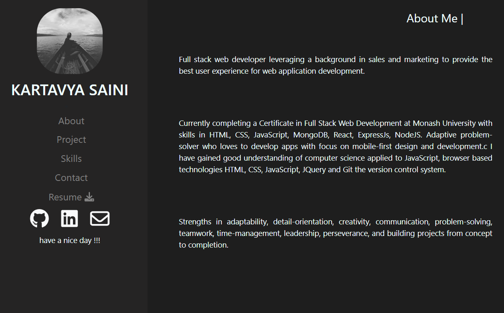
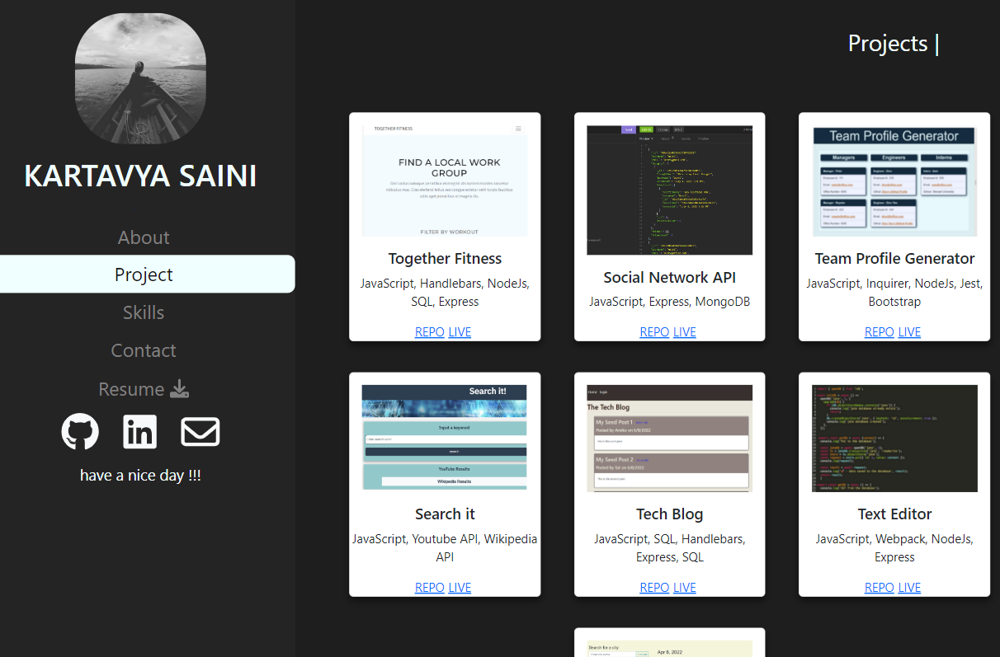
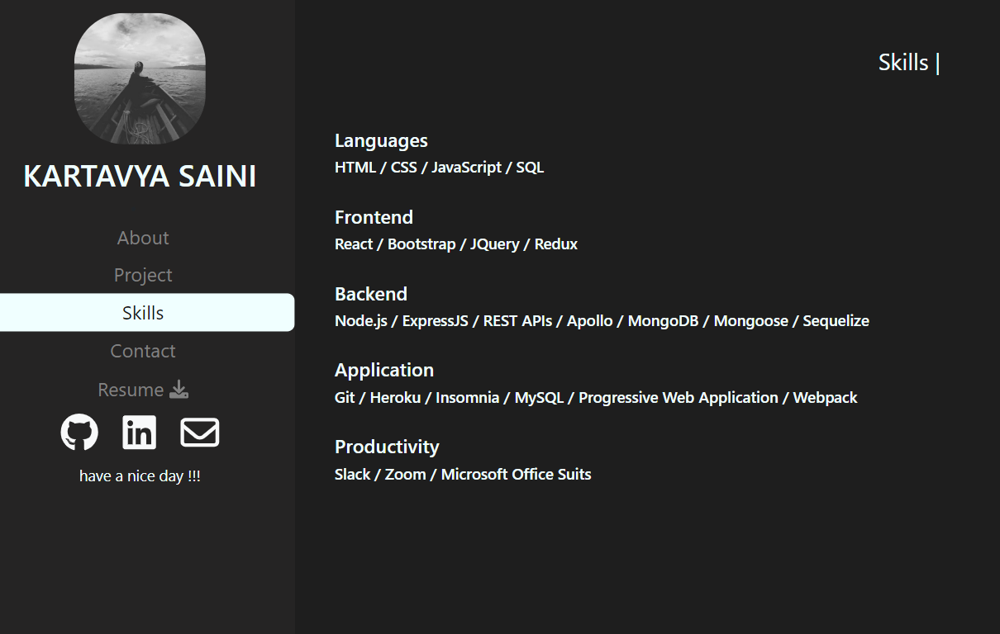
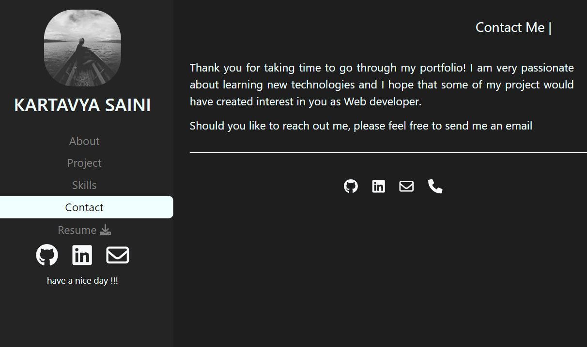

# Kartavtya Portfolio

This portfolio is designed to demonstrate my skills from past to most recent projects. It is a platform to showcase my skills and of my growth throughout the journey of a developer

# Link to live application - [Portfolio link](https://kartavya99.github.io/react-portfolio/)

# Features and Technologies uses

- JavaScript
- Node.js
- ReactJS
- Bootstrap
- CSS
- HTML

# Below are the sample pages of command line application

## About

## Projects

## Skills

## Contact

